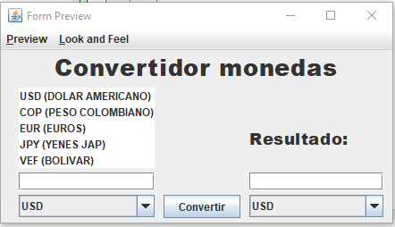
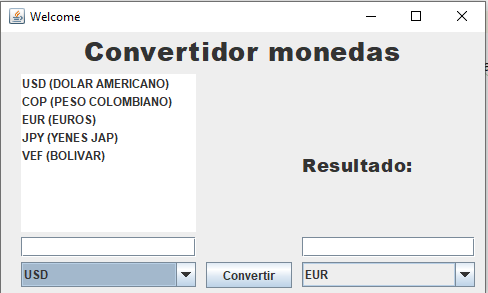
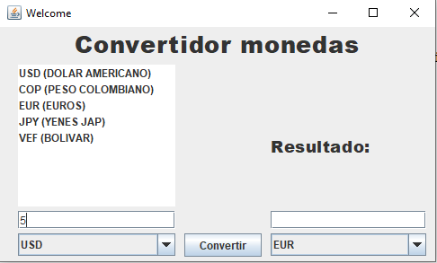
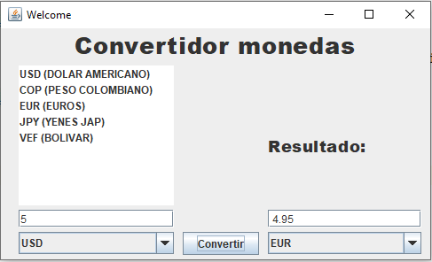

# covertidor_monedas_java

# IMPORTANTE!!! LA VERSION TOTALMENTE FUNCIONAL DE ESTE PROGRAMA SE ENCUENTRA EN LA RAMA "master"

implementar el convertidor de divisas con 5 monedas, tanto de origen como de destino.

NOMBRES: Kevin Moreno, Erick Palomo, Martin Rosero.

El programa nos muestra una interfaz grafica con la informacion de todas las divisas disponibles.

1) Seleccionaremos las divisas que deseamos para obtener el resultado que quiera.

2) Ingrese el valor (en numeros no en letras) de la divisa original para obtener su equivalencia.

3) Dar click en el boton "Convertir" y obtendra el resultado de equivalencia en la divisa seleccionada.

4) Para salir del programa solo cierrelo dando click en la "X" y para reutilizarlo solo repita los pasos anteriores.